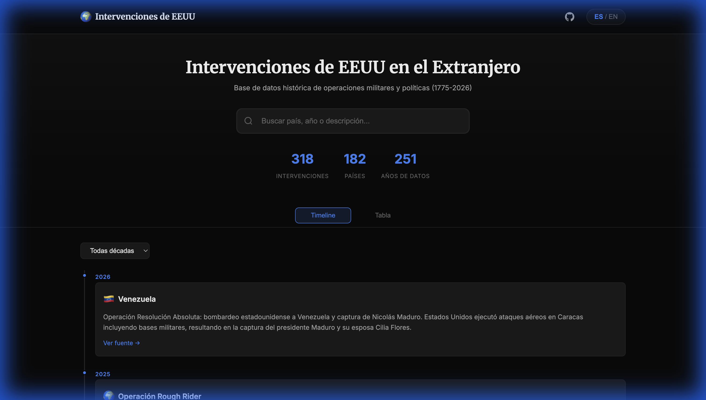

# 🌍 Intervenciones de EEUU en el Extranjero

[](https://vlasvlasvlas.github.io/interventions/)
[](https://creativecommons.org/licenses/by-sa/4.0/)
[](https://es.wikipedia.org/wiki/Anexo:Intervenciones_militares_de_los_Estados_Unidos)
[](https://vlasvlasvlas.github.io/interventions/)

Base de datos interactiva de intervenciones militares y políticas de Estados Unidos en el extranjero (1775-2026).

🔗 **Demo en vivo**: [https://vlasvlasvlas.github.io/interventions/](https://vlasvlasvlas.github.io/interventions/)



---

## 📚 Objetivo

Este proyecto tiene un **objetivo didáctico**: facilitar la comprensión del contexto histórico de las relaciones internacionales a través de una visualización clara y accesible de datos públicos.

No promueve ninguna posición política. La información se presenta de manera neutral con fines educativos.

---

## ✨ Características

### Datos
- **318 intervenciones** documentadas (1775-2026)
- **Fuentes verificables** de Wikipedia (ES/EN)
- **Descarga abierta** en CSV y JSON

### Visualización
- 📅 **Timeline** cronológica con cards expandibles
- 📊 **Tabla paginada** (10 registros/página)
- 🔍 **Búsqueda inteligente** por país, año o descripción
- 🏳️ **Banderas** con emojis de países

### UX/UI
- 🌙 **Dark theme** elegante y accesible
- 📱 **Mobile-first** responsive design
- 🌐 **Bilingüe** ES/EN completo
- ⬆️ **Botón scroll-to-top**

### Técnico
- ⚡ **PWA** instalable con Service Worker
- 🔍 **SEO optimizado** (JSON-LD, Open Graph, sitemap)
- ♿ **Accesible** (aria-live, semántica)
- 📦 **Zero dependencies** (HTML/CSS/JS puro)

---

## 📊 Fuentes de Datos

| Fuente | Idioma | Link |
|--------|--------|------|
| Intervenciones militares de EEUU | ES | [Wikipedia](https://es.wikipedia.org/wiki/Anexo:Intervenciones_militares_de_los_Estados_Unidos) |
| Timeline of US military operations | EN | [Wikipedia](https://en.wikipedia.org/wiki/Timeline_of_United_States_military_operations) |
| Golpes de estado en América Latina | ES | [Wikipedia](https://es.wikipedia.org/wiki/Intervención_estadounidense_en_golpes_de_Estado_en_América_Latina) |

---

## 🛠️ Stack Técnico

| Tecnología | Uso |
|------------|-----|
| HTML5 | Estructura semántica |
| CSS3 | Variables, Grid, Flexbox, animaciones |
| JavaScript ES6+ | Lógica sin frameworks |
| JSON | Datos + i18n |
| GitHub Pages | Hosting |

---

## 📁 Estructura

```
interventions/
├── index.html          # Página principal  
├── styles.css          # Estilos (dark theme)
├── app.js              # Lógica
├── manifest.json       # PWA manifest
├── sw.js               # Service Worker
├── robots.txt          # SEO
├── sitemap.xml         # SEO
├── screenshot.png      # Preview
├── README.md
├── i18n/
│   ├── es.json         # Español
│   └── en.json         # English
└── data/
    └── interventions.json  # 318 registros
```

---

## 🚀 Uso Local

```bash
# Clonar
git clone https://github.com/vlasvlasvlas/interventions.git
cd interventions

# Servidor local
python3 -m http.server 8080

# Abrir http://localhost:8080
```

---

## 🌐 Deploy

El sitio se despliega automáticamente en GitHub Pages desde la rama `main`.

**URL**: https://vlasvlasvlas.github.io/interventions/

---

## 📜 Licencia

**CC BY-SA 4.0** - Los datos provienen de Wikipedia y están sujetos a la misma licencia.

---

## 📧 Contacto

- **GitHub**: [@vlasvlasvlas](https://github.com/vlasvlasvlas)

---

<p align="center">📚 Datos abiertos con fines educativos</p>
